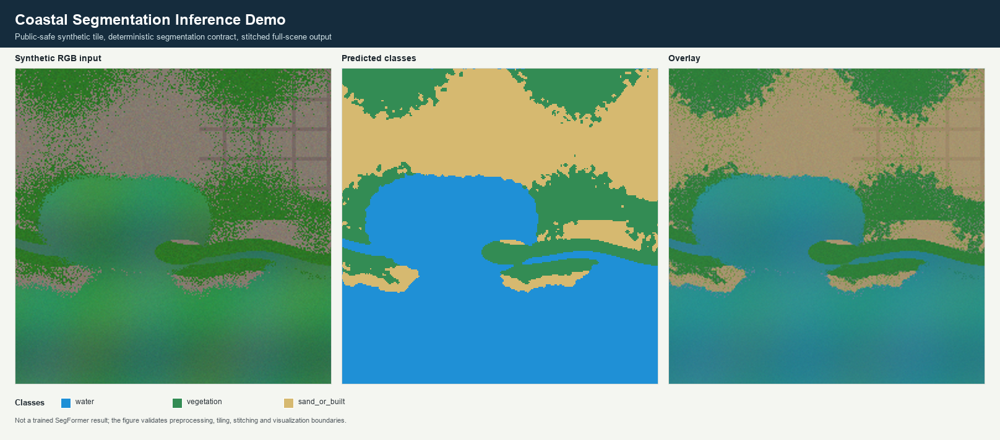

# Coastal SegFormer Inference

Geospatial AI inference harness for coastal semantic segmentation.

The default run uses a synthetic multispectral-like tile and a deterministic
lightweight segmentation head to exercise preprocessing, tiling, stitching and
visualization. The SegFormer adapter is isolated so that a licensed checkpoint
can be mounted explicitly when available.



## Scope

The harness covers the engineering contract around coastal segmentation
inference:

- multispectral-like input preparation;
- tile/window generation;
- per-tile class logits;
- stitched full-scene prediction;
- input/mask/overlay visualization;
- explicit checkpoint and dataset policy.

## Quick start

```powershell
cd coastal-segformer-inference
python -m pip install -e .
coastal-segformer-inference run --config configs/example_inference.yml
python -m unittest discover -s tests
```

Without installing:

```powershell
$env:PYTHONPATH = "src"
python -m coastal_segformer_inference run --config configs/example_inference.yml
python -m unittest discover -s tests
```

## Outputs

| Output | Purpose |
|---|---|
| `outputs/inference/synthetic_rgb.png` | Synthetic input |
| `outputs/inference/segmentation_triplet.png` | Input, predicted classes and overlay |
| `outputs/inference/class_summary.csv` | Class fractions |
| `outputs/inference/metadata.json` | Processing scope and run metadata |

## Important limitation

This repository must not include restricted `_ST` data, labels, trained weights
or active research metrics. It covers the inference pattern and the geospatial
handling around a model.

The current default output must not be described as a trained SegFormer result.
See `docs/inference_scope.md`.

## Optional SegFormer adapter

`src/coastal_segformer_inference/segformer_adapter.py` shows where a Hugging Face
SegFormer checkpoint can be mounted after dataset and checkpoint-license
review. It is not used by the default run because random weights would produce
meaningless maps.

## Extension options

| Option | Pros | Cons |
|---|---|---|
| Open benchmark dataset | Real data and clearer reproducibility | Need dataset-license check |
| Synthetic tile fixture | Fast and reproducible | Less informative than real imagery |
| Pretrained generic SegFormer | Easy to run | May not be EO-specific |
| Tiny trained model on open data | More realistic validation path | More work and validation burden |
